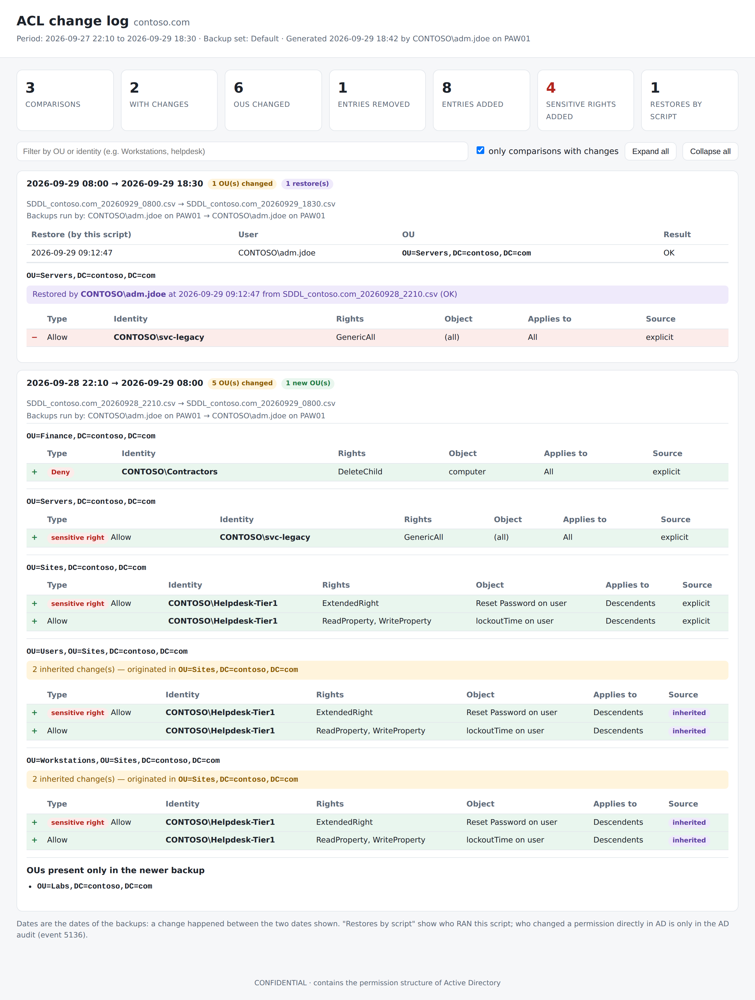

# ADDS DACL Backup & Restore

**Backup, restore and change log of Active Directory permissions (DACL) — with a single PowerShell script (`ACL-ADDS-BACKUP.ps1`).**

Created by **[Fabio Furlanetti](https://www.linkedin.com/in/fabiofurlanetti/)**.

ACL-ADDS saves the security descriptor of the domain root and of every Organizational Unit (OU), compares backups over time to show *what* changed in your delegations, and restores the DACL of a single object with a preview, an undo file and post-write verification.

No RSAT, no `ActiveDirectory` module, no `AD:` drive. It uses only `System.DirectoryServices`, which is built into Windows.

<picture>
  <source media="(prefers-color-scheme: dark)" srcset="docs/images/changelog-report-dark.png">
  
</picture>

<sub>Change log HTML report generated from **fictitious sample data** (contoso.com). The interactive file is in [`docs/sample-report.html`](docs/sample-report.html): download it and open it in a browser to try the filter and the expand/collapse buttons.</sub>

---

## Features

- **Backup (read-only):** SDDL of the domain root and all OUs, for one domain or for all configured domains.
- **Restore (modifies AD):** restores **one** object at a time, with:
  - a preview of the entries that will be removed `[-]` and added `[+]`;
  - `-WhatIfMode` to simulate without writing anything;
  - an undo file (`BEFORE_RESTORE_*.txt`) saved before writing;
  - verification after writing.
- **Inherited change detection:** if the differences on an OU are *inherited*, restoring that OU would have no effect, because AD rebuilds inherited entries from the parent. ACL-ADDS walks up the OU chain, finds the parent where the change was originally made and offers to restore **that** object instead.
- **Change log (read-only):** compares consecutive backups of a domain and shows, for each OU, the removed and added entries, whether they are explicit or inherited, and the parent OU of origin.
- **HTML report:** a self-contained file that works offline. It has summary cards, a filter by OU or identity, and highlights sensitive rights such as `GenericAll`, `WriteDacl`, `WriteOwner`, `GenericWrite`, all extended rights, replication and password reset.
- **Operations log:** records who ran each backup and restore (`DOMAIN\user`, computer, target, result). The change log shows this information next to each comparison.
- **Unattended mode:** `-Mode Backup -AllDomains -Label Monthly` for a scheduled task, with a transcript and exit codes.

---

## How it works: the workflow

> **The change log and the HTML report depend on this workflow.** They compare two backups. A change made after the latest backup is not in any backup, so it cannot be shown.

```
 1. Backup  BEFORE changing ACLs   →  saves the PREVIOUS state
 2. Make the ACL changes in AD
 3. Backup  AFTER the changes       →  saves the CURRENT state
 4. Change log / HTML report        →  compares (1) with (3)
```

For a planned change, back up **immediately before** the change window and **again right after it**. The change log then shows exactly what changed in that window and nothing else, which makes it useful as change evidence.

The script reminds you of this at each step:

- **Main menu:** shows the workflow line.
- **After a backup:** warns when it is the **first** backup of the domain (*"run Backup again after you change ACLs"*), or shows the previous backup the change log will compare with.
- **Change log:** shows the date and age of the latest backup, warns that changes made after it are **not** included, and offers to **run a new backup now** before comparing. With fewer than two backups, it explains the workflow instead of comparing.
- **After a restore:** reminds you to run a backup, so the change log also records the state after the restore.

---

## Requirements

| Item | Requirement |
|---|---|
| PowerShell | Windows PowerShell 5.1, or PowerShell 7 on Windows |
| Language mode | **FullLanguage** (see [Troubleshooting](#troubleshooting)) |
| Backup / Change log | An account that can read the security descriptors of the OUs (usually granted to Authenticated Users by default) |
| Restore | An account allowed to **modify permissions** on the target object (e.g. Domain Admins or delegated) |
| Network | LDAP access to a domain controller of each domain |

---

## Installation

1. Download `ACL-ADDS-BACKUP.ps1` to a protected folder on an administrative workstation. A Privileged Access Workstation (PAW) is recommended.
2. Remove the downloaded-file mark (only after reviewing the code):
   ```powershell
   Unblock-File .\ACL-ADDS-BACKUP.ps1
   ```
3. **Recommended:** sign the script with your organization's code signing certificate, especially if your policy is `AllSigned` (see [Security considerations](#security-considerations)).

---

## Configuration

All settings are in the **CONFIGURATION** block at the top of `ACL-ADDS-BACKUP.ps1`:

```powershell
# ============================================================================
#  CONFIGURATION - edit for your environment (re-sign the script after editing)
# ============================================================================

# Folder for backups, operations log, reports and transcripts.
$BackupFolder = 'C:\ACL-ADDS\Backups'

# Domains (FQDN) listed in the Backup menu, used by "[A] All domains" and by -AllDomains.
$DefaultDomains = @()

# OPTIONAL second copy on a network share (UNC path). '' = disabled.
$NetworkFolder = ''
```

### Where to add your domains

Edit **`$DefaultDomains`** and list the FQDN of each domain you want to back up and restore:

```powershell
$DefaultDomains = @('contoso.com', 'emea.contoso.com', 'fabrikam.local')
```

These domains then:

- appear numbered in the **Backup** menu, together with the **[A] All domains** option;
- are backed up by `-Mode Backup -AllDomains`.

Restore and Change log do **not** need this list. They work with whatever backup files exist in `$BackupFolder`, so any domain that has been backed up can be restored and compared.

If you leave the list empty, you can still:

- use **[C] Custom domain** in the Backup menu and type a domain at run time;
- use `-Mode Backup -Domain contoso.com` in unattended mode;
- use `-Mode Backup -AllDomains`, which also discovers every domain of the **current forest** automatically. Domains in other forests must be listed in `$DefaultDomains` or passed with `-Domain`.

> If the script is signed, **sign it again** after editing the configuration. Any change invalidates the signature.

### Backup folder

`$BackupFolder` holds every file the script creates. Choose a local folder with access restricted to AD administrators. See [Security considerations](#security-considerations) for why this matters.

### Network copy (optional)

To keep a second copy of everything on a file share, set **`$NetworkFolder`** to a UNC path, the same way you set `$DefaultDomains`:

```powershell
$NetworkFolder = '\\fileserver.contoso.com\ADBackups\ACL'
```

When it is set:

- every file the script creates is also copied to the share: backups, `BEFORE_RESTORE` undo files (copied **before** AD is changed), HTML reports in `Reports\` and transcripts in `Logs\`; labeled sets go to `<NetworkFolder>\<Label>`;
- each line of the operations log is **appended** to `OPERATIONS_LOG.csv` on the share, never overwritten, so the share keeps a consolidated log when several administrators or machines run the script;
- in Restore and Change log, the network copy appears as extra backup sets (`Network`, `Network\<Label>`), listed **after** the local ones. Local files keep priority: `ENTER` always selects the local default set;
- if the share is unavailable, everything still completes locally, a warning is shown and the operations log records `network copy: FAILED`. In unattended mode this returns exit code `1` (partial).

Leave it as `''` to disable the network copy. The account that runs the script needs write access to the share, and the share must be protected like the local folder.

---

## Usage

```powershell
.\ACL-ADDS-BACKUP.ps1                 # interactive menu
.\ACL-ADDS-BACKUP.ps1 -WhatIfMode     # restore only simulates, nothing is written
.\ACL-ADDS-BACKUP.ps1 -ShowFull       # restore also lists all CURRENT and BACKUP entries
```

```
  ── Main menu ──────────────────────────────
   [1] Backup      read-only
   [2] Restore     MODIFIES AD
   [3] Change log  read-only
   [0] Exit
```

### 1) Backup

Choose a domain, **[A] All domains** or **[C] Custom domain**. For each domain, the script writes:

| File | Content |
|---|---|
| `SDDL_<domain>_<yyyyMMdd_HHmm>.csv` | SDDL of the root and of every OU. **This is the restore source.** |
| `ACL_<domain>_<yyyyMMdd_HHmm>.csv` | Readable list of the entries, for review |
| `ERRORS_<domain>_<yyyyMMdd_HHmm>.csv` | Objects that could not be read (only created if there are errors) |

Run a backup **immediately before** any planned change to permissions, and again afterwards (see [the workflow](#how-it-works-the-workflow)). The change log can then prove that only the expected changes were made.

### 2) Restore

1. Choose the backup set (only asked if labeled sets exist) and the `SDDL_*.csv` file.
2. Choose the object by number. Typing text filters the list, for example `Workstations`.
3. Review the preview:
   - `[-]` explicit entries that will be removed;
   - `[+]` explicit entries that will be added;
   - `[~]` **inherited** differences. These come from a parent. The script shows the parent OU where the change was made and offers to restore it.
4. Confirm with `Y`.

The script then:

- saves the current DACL to `BEFORE_RESTORE_<object>_<date>.txt`, which you can use to undo the restore;
- applies the DACL from the backup;
- reads the DACL back and compares it with the backup.

**Good practice:** run with `-WhatIfMode` first. After restoring a parent (or the domain root), allow a few minutes for AD to propagate inheritance, then check the child OUs with `-WhatIfMode`.

> The restore replaces the **whole DACL** of the object with the one in the backup. Legitimate changes made to that object after the backup are reverted too.

### 3) Change log

Choose a domain. The script shows the date of its latest backup and offers to run a new one first, so that changes made since then are included. Then choose how many recent comparisons to show. For each pair of consecutive backups, the change log shows:

- who ran each backup;
- the restores done by the script in that period, marked `[R]`;
- each OU whose permissions changed, with the removed and added entries, marked `(inherited)` when applicable;
- for inherited changes, the parent OU where they originated, marked `[^]`;
- OUs that were created or deleted between the two backups.

At the end, you can export the same comparisons to `Reports\CHANGELOG_<domain>_<date>.html`.

> Dates are the dates of the **backups**: a change happened somewhere between the two dates shown. The change log does not know **who** changed a permission directly in AD. For that, enable AD auditing (see below).

---

## Unattended mode (scheduled task)

```powershell
.\ACL-ADDS-BACKUP.ps1 -Mode Backup -AllDomains -Label Monthly
.\ACL-ADDS-BACKUP.ps1 -Mode Backup -Domain contoso.com,fabrikam.local
```

| Parameter | Description |
|---|---|
| `-Mode Backup` | Runs without menus or questions |
| `-AllDomains` | `$DefaultDomains` + every domain of the current forest |
| `-Domain` | Specific domain(s); can be combined with `-AllDomains`. With `powershell.exe -File` (e.g. in a scheduled task), a comma list arrives as a single string: back up one domain per `-Domain`, or list the domains in `$DefaultDomains` and use `-AllDomains` |
| `-Label` | Saves the set to `<BackupFolder>\<Label>`, e.g. `Monthly`. Letters, digits, `_` and `-` only |

Each run writes a transcript to `<BackupFolder>\Logs` and a summary line (`BackupRun`) to the operations log.

**Exit codes:** `0` = all domains OK · `1` = partial (a domain failed, had read errors, or the network copy failed) · `2` = failed or invalid parameters.

Labeled sets (e.g. `Monthly`) appear as a separate **backup set** in Restore and Change log, so a monthly series can be compared month against month.

### Example: monthly task with a gMSA

`New-ScheduledTaskTrigger` has no monthly option, so the task is created with `schtasks.exe` and its account is then changed to a group Managed Service Account (gMSA):

```powershell
schtasks.exe /Create /TN "ACL-ADDS\Monthly backup" /SC MONTHLY /D 1 /ST 02:00 /RU SYSTEM `
  /TR "powershell.exe -NoProfile -NonInteractive -File C:\ACL-ADDS\ACL-ADDS-BACKUP.ps1 -Mode Backup -AllDomains -Label Monthly"

$Principal = New-ScheduledTaskPrincipal -UserId 'CONTOSO\gmsa-acladds$' -LogonType Password
Set-ScheduledTask -TaskPath '\ACL-ADDS\' -TaskName 'Monthly backup' -Principal $Principal
```

The gMSA must be allowed to retrieve its password on that server, needs **Log on as a batch job**, and needs write access to `$BackupFolder` (and to `$NetworkFolder`, if configured). Backup is read-only, so the gMSA does **not** need to be a Domain Admin.

---

## Files created

```
<BackupFolder>\
├── SDDL_<domain>_<date>.csv        restore source
├── ACL_<domain>_<date>.csv         readable entries
├── ERRORS_<domain>_<date>.csv      unreadable objects (if any)
├── BEFORE_RESTORE_<object>_<date>.txt   undo file of each restore
├── OPERATIONS_LOG.csv              who ran each backup / restore
├── Reports\CHANGELOG_<domain>_<date>.html
├── Logs\TRANSCRIPT_Backup_<label>_<date>.txt
└── <Label>\                        labeled backup sets (e.g. Monthly)

<NetworkFolder>\                    optional: same structure, with the operations log appended
```

---

## Scope and limitations

- **Covered:** the domain root (`DC=...`) and every object of class `organizationalUnit`.
- **Not covered:** containers such as `CN=Users`, `CN=Computers` and `CN=System`, including `CN=AdminSDHolder`; the Configuration and Schema partitions (e.g. AD CS objects); GPO objects and SYSVOL; DNS zones; ACLs on individual users, groups and computers.
- **DACL only:** the owner is saved in the backup, but only the DACL is compared and restored. The SACL (auditing) is not saved.
- **Delegation model:** inherited entries cannot be restored on a child object; restore the parent where they were set. The script detects this case and points to the parent.
- **Detection of the origin** is a correlation, not proof. It matches entries changed the same way on a parent and on its children.
- Reads and writes use serverless binding (`LDAP://<domain>/...`), so they may reach different domain controllers. Allow time for replication before verifying.

ACL-ADDS **complements** — and does not replace — System State backups of your domain controllers, the AD Recycle Bin and a forest recovery plan.

---

## Security considerations

- **The backup files are sensitive.** They describe every delegation in your AD, which is valuable information for an attacker. Keep `$BackupFolder` on a protected host, with access limited to AD administrators. Never commit backups or reports to a repository; the included `.gitignore` excludes them.
- **The restore writes whatever is in the CSV.** Anyone able to edit a backup file could insert permissions that a later restore would grant. Protect the folder accordingly.
- **Run from a hardened administrative workstation** (PAW / Tier 0), not from a general-purpose machine or a file share.
- **Sign the script.** A signed script cannot be modified without invalidating the signature. Use a code signing certificate from your PKI, publish it to *Trusted Publishers* via GPO, and re-sign after every change.
- **Do not bypass your execution policy.** The script does not change it and does not require `Bypass`.
- **Who changed what:** this script records who **ran it**. To know who changed a permission directly in AD, enable *Audit Directory Service Changes* on your domain controllers, configure SACLs on the objects, and collect **event 5136** (attribute `nTSecurityDescriptor`) from all DCs.

---

## Troubleshooting

| Symptom | Cause / solution |
|---|---|
| `File ... is not digitally signed` | The execution policy is `AllSigned`, or the file is treated as remote (downloaded or on a UNC path). Check with `Get-ExecutionPolicy -List`. Sign the script, or run `Unblock-File` on a reviewed local copy. |
| `PowerShell is running in ConstrainedLanguage mode` | AppLocker or WDAC restricts unapproved scripts. Ask the policy owner to allow your signing certificate (publisher rule). The script stops on purpose instead of producing incomplete results. |
| `DACL changed (could not decode the entries: ...)` | The message after `:` shows the real error. A common cause is a backup file whose SDDL is empty or truncated. |
| A GUID instead of a name in the entries | The attribute or extended right is not in the built-in name list (`$KnownGuids`). The entry is still compared and restored correctly. |
| The restore says *inherited differences* and changes nothing | The change was made on a parent. Choose the parent the script suggests. |

---

## Contributing

Issues and pull requests are welcome. Please test changes in a lab domain, with `-WhatIfMode` first, and never include real backup files, reports or domain names in issues.

## Author

**Fabio Furlanetti** — creator of the ACL-ADDS backup, restore and change log process.  
LinkedIn: [linkedin.com/in/fabiofurlanetti](https://www.linkedin.com/in/fabiofurlanetti/)

## License

Choose a license for the repository (for example MIT) and add a `LICENSE` file.

## Disclaimer

This script modifies Active Directory permissions when you use Restore. Test it in a non-production environment first and follow your organization's change management process. Use at your own risk.

Microsoft and Active Directory are trademarks of the Microsoft group of companies. This is an independent community project and is not affiliated with, sponsored by or endorsed by Microsoft.
